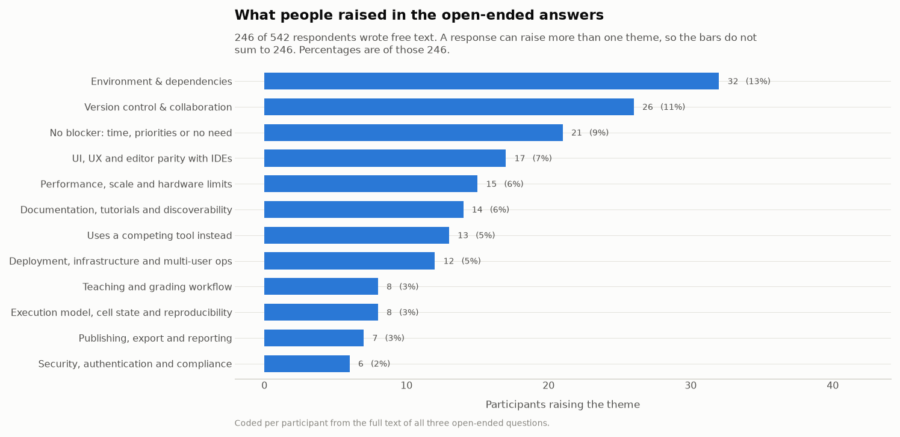
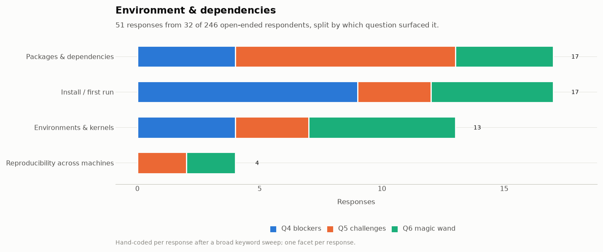
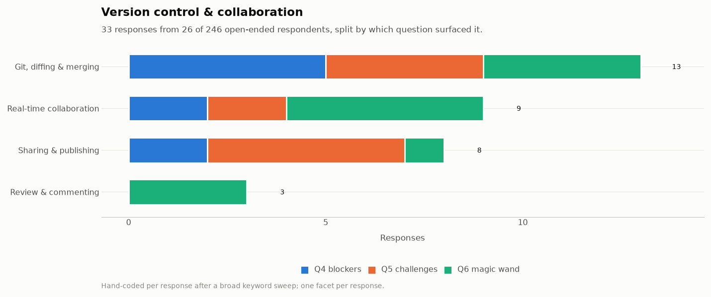
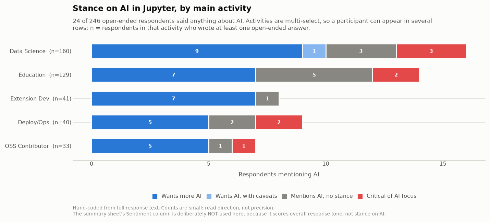
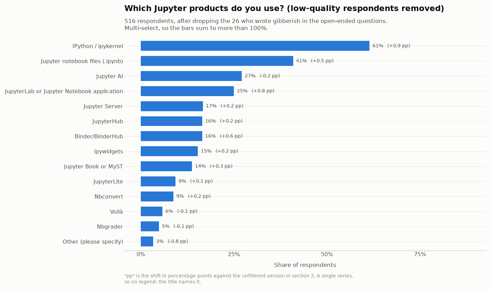
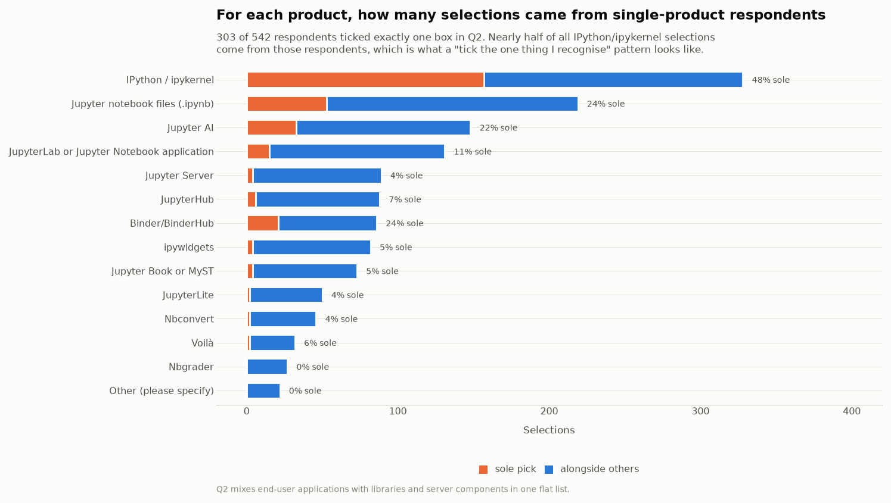
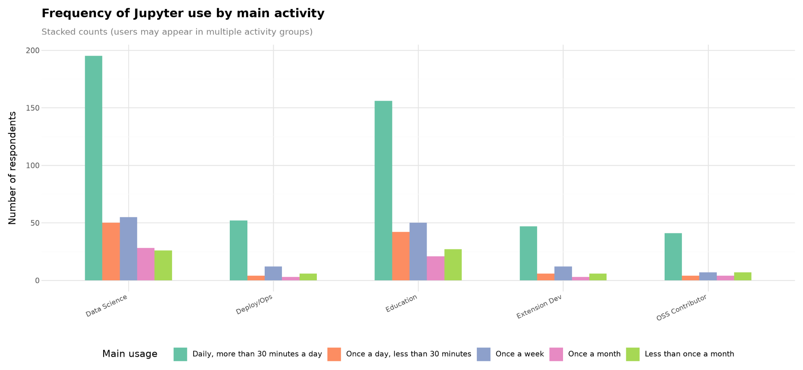

# What you told us: results from the 2026 Jupyter User Experience and Product Enhancement Survey

*Jupyter Foundation*

From time to time, Jupyter runs [user surveys](https://github.com/jupyter/surveys/) to understand how our communities use Jupyter technology (or alternatives) and how they feel about it. We recently completed a user experience survey for 2026\. It was open between 29 May and 29 June 2026, with 542 people providing answers. This post covers what we found, what you can do today about the most common problems, and where we are looking for proposals.

Each of the areas below rose to the top of pain points that users consistently felt. **We would love to see applications in the [2026 Call for Proposals](https://jupyterfoundation.org/community-funding-proposals/submit-a-proposal/)** that address any of these areas by improving Jupyter technology. In some areas, there are already Jupyter tools (or third-party tools) that address some of the issues, and we list them as a guide to readers who want to learn more.

***About the responses**: Three of the six questions were free text, and 246 people wrote something in at least one of them, some at considerable length. Writing several paragraphs about environment setup or version control at the end of a survey takes real time, and that detail shaped most of what follows. We want to extend our heartfelt appreciation to everyone who answered this survey, high-quality experience stories like this are crucial at shaping Jupyter’s priorities and technical direction.*

---

## Who answered

Two thirds of respondents (65%) use Jupyter for data science and analysis, and 55% use it in education. Smaller groups deploy Jupyter for others (14%), develop extensions (14%), or contribute to the open-source project (12%). These add to more than 100% because the question accepted multiple answers. See the Appendix below for a deeper dive into the respondents and the tools they reported using. Below we’ll focus on the pain-points and themes that were commonly reported, since those are the most actionable for our community to improve upon and learn from.

## Common themes that people raised

We reviewed all 677 free-text responses and coded the recurring themes, cross-checking the coding against the source responses.

Environment and dependency management, and version control and collaboration, are the two largest friction themes, and between them account for 51 of the 246 people who wrote to us, with 7 raising both. Other themes follow closely: interface and editor parity (17 people), handling large data sets and performance (15), documentation and discoverability (14), respondents who use a different tool instead (13), deployment and multi-user operations (12), and security, authentication and compliance (6).

When we asked what is blocking people from using Jupyter more, 130 of 239 answers named something concrete, while 53 said that nothing is blocking them, either in a sentence or as a one-word "no". Limited time and competing priorities appear throughout those 53 responses.

The Foundation is committed to finding ways to address these pain points across our community, and we'll be exploring other ways to make progress in these areas in the coming months.

---

## Environment and dependency management

This was the largest friction theme, raised by 32 people across 51 responses.

The responses concentrate in three sub-problems:

1. Installation and first run, and package and dependency management, account for 17 responses each.  
2. Environment and kernel registration accounts for 13  
3. Reproducing an environment on a second machine for 4\.

What connects them is that the failures arrive early and are hard to diagnose from the error message alone. For example: an installation completes but the jupyter command cannot be found; packages install into one environment while the notebook runs a kernel from another; a course needs the same environment on thirty machines that nobody administers centrally. Each of these has a known cause, and in many cases, a known fix, but users struggle to find the right solution to these problems.

We welcome submissions in our [Call for Proposals](https://jupyterfoundation.org/community-funding-proposals/submit-a-proposal/) to improve upon these pain points\! We’ve also sourced a few recommended tools within Jupyter and from third-parties that partially address these challenges, and list them below for readers that want to learn more.

Tools that partially address this problem…

**From Project Jupyter:**

* [**JupyterLab Desktop**](https://github.com/jupyterlab/jupyterlab-desktop) bundles Python and JupyterLab in a single installer and removes most first-run failures. [v4.6.2](https://github.com/jupyterlab/jupyterlab-desktop/releases/tag/v4.6.2-1) was released recently.  
* [**JupyterLite**](https://jupyterlite.readthedocs.io/) and [**Binder**](https://mybinder.org/) avoid per-machine installation entirely, which is often the right answer for teaching.  
* python \-m jupyter lab works when a pip install succeeds but the entry point is not on your PATH. This is a common cause of "command not found" straight after a successful install.  
* [**repo2docker**](https://github.com/jupyterhub/repo2docker) fetches a git repository and builds a container image based on the configuration \- useful for creating reproducible images for use with Binder or JupyterHub  
* %pip install and %conda install run inside a notebook and install into the environment the running kernel is actually using, which is usually what goes wrong when installing from a terminal

**From third-parties:**

* better package installation from UI  
  * [**gator**](https://github.com/mamba-org/gator) creates and manages conda environments from the JupyterLab interface.  
  * [**package-manager**](https://github.com/mljar/package-manager) browses and installs Python packages without leaving the interface.  
* kernel per environment which encodes “lockfile”  
  * [**pyproject-local-kernel**](https://github.com/bluss/pyproject-local-kernel) provisions kernels per environment for the project the notebook file resides in.  
  * [**pixi-kernel**](https://github.com/renan-r-santos/pixi-kernel) Per-directory Pixi environments with multi-language Jupyter kernels.  
* notebook itself can include requirements  
  * [**juv**](https://github.com/manzt/juv) is CLI tool that encodes dependencies in the notebook using PEP 723 (inline script metadata) and creates ephemeral virtual environments for kernel execution  
  * [**juvio**](http://github.com/OKUA1/juvio) also encodes dependencies in the notebook using PEP 723 but also includes bespoke integration with jupyter kernel spec manager and a JupyterLab extension  
* better integration with other environment management tools  
  * [**nb-conda-kernels**](https://github.com/anaconda/nb_conda_kernels) and [**nb-nebi-kernels**](https://github.com/nebari-dev/nb-nebi-kernels) provision kernel specs auto-discovered from all conda and nebi-tracked pixi environments respectively  
  * [**jupyterlab-launchpad**](https://github.com/nebari-dev/jupyterlab-launchpad) replaces the launcher with one that has first-class support for kernels discovered from conda and nebi-tracked pixi environments  
  * [**jupyterhub-fancy-profiles**](https://github.com/2i2c-org/jupyterhub-fancy-profiles) allows JupyterHub users to select a Binder-like environment and build it at hub launch time.  
* uv, pixi, conda and mamba all work with Jupyter and remove a class of dependency conflict.

Several respondents asked for closer integration between Jupyter and environment managers, including a graphical option for people who do not work at a command line, which is part of what those extensions provide. A consistent environment and kernel story across package managers and operating systems still requires sustained work across several projects, and we would welcome proposals in this area. Another area where future work is needed is preventing the drift between server and kernel environments (join the [discussion](https://github.com/jupyterlab/jupyterlab/issues/19249)).

---

## Version control and collaboration

This theme was raised by 26 people across 33 responses.

Git diffing and merging accounts for 13 responses, real-time collaboration for 9, sharing and publishing for 8, and review and commenting for 3\.

The underlying cause is that the notebook format stores code, outputs and execution metadata in a single JSON document. Tools built to compare source line by line report changes that are technically accurate and hard to read: re-executing a cell without editing it can produce a large diff, and merges conflict on execution counts and output data rather than on anything a person wrote (which can be desirable when reproducibility is the primary goal, but less so when prioritizing iterative development). Reviewing a colleague's notebook therefore costs more than reviewing an equivalent script, which pushes teams either toward exporting notebooks to scripts before review, or toward skipping review.

We welcome submissions in our [Call for Proposals](https://jupyterfoundation.org/community-funding-proposals/submit-a-proposal/) to improve upon these pain points\! We’ve also sourced a few recommended tools within Jupyter and from third-parties that partially address these challenges, and list them below for readers that want to learn more.

Tools that partially address this problem…

**From Project Jupyter:**

* [**nbdime**](https://nbdime.readthedocs.io/) provides content-aware diff and merge that understands cells and outputs. Running nbdime config-git \--enable \--global once makes git diff on a notebook readable.  
* [**jupyterlab-git**](https://github.com/jupyterlab/jupyterlab-git) brings Git operations into the JupyterLab interface and uses nbdime for diffs.  
* [**jupyter-collaboration**](https://github.com/jupyterlab/jupyter-collaboration/) brings real time collaboration; it allows several people to edit the same notebook simultaneously and time-travel to older versions.

**Third-party:**

* [**Jupytext**](https://jupytext.readthedocs.io/) pairs a notebook with a .py or .md file that diffs and merges like an ordinary source, which makes notebook changes reviewable in a normal pull request.  
* **nbstripout** tools remove most merge conflicts for teams that do not need outputs in version control. The community has produced at least three variants: [nbstripout](https://github.com/kynan/nbstripout), the original; [nbstripout-fast](https://github.com/deshaw/nbstripout-fast), a faster alternative; and [fastai-nbstripout](https://github.com/fastai/fastai-nbstripout) (no longer maintained). They differ in behaviour and performance, so pin whichever you adopt. We read this fragmentation as a consequence of the gap, and a single well-supported answer would be a reasonable thing to propose.

Most of the tools above ship separately from JupyterLab and have to be installed and configured before they help, which limits how many people find them. We are considering both closer integration of these tools into the default experience and approaches that reduce the underlying problem, and we would welcome proposals for either.

Review and commenting on notebooks remains the clearest gap. Nothing in the current stack provides a way to leave a comment on a cell and resolve it later; that also works for colleagues who do not use GitHub.

---

## The interface, and parity with editors

Seventeen people wrote about the interface, and their requests are concrete rather than architectural: completion as you type, a variable explorer, working drag and drop, faster scrolling in long notebooks, and a more modern appearance.

We welcome submissions in our [Call for Proposals](https://jupyterfoundation.org/community-funding-proposals/submit-a-proposal/) to improve upon these pain points\! We’ve also sourced a few recommended tools within Jupyter and from third-parties that partially address these challenges (including a few JupyterLab plugins that directly solve the problem), and list them below for readers that want to learn more.

Tools that partially address this problem…

**From Project Jupyter:**

* [**JupyterLab Desktop**](https://github.com/jupyterlab/jupyterlab-desktop). The project went through a period with little activity, which some respondents referred to. It now has active maintainers and regular releases, and [v4.6.2](https://github.com/jupyterlab/jupyterlab-desktop/releases/tag/v4.6.2-1) was published after the survey closed.  
* **Jupyter Notebook v7** now includes multiple improvements covering features requested by respondents, inheriting them from JupyterLab; after reviewing the survey answers we improved the documentation to mention the variable explorer available in the [debugger](https://jupyterlab.readthedocs.io/en/stable/user/debugger.html#usage) (which has basic support, while the plugin below has more in-depth support) and the opt-in as-you-type [autocompletion](https://jupyterlab.readthedocs.io/en/stable/user/completer.html).  
* [**jupyterlab-lsp**](https://github.com/jupyter-lsp/jupyterlab-lsp) adds better completion, jump-to-definition, signature help and diagnostics.

**Third-party:** the variable explorer people asked for, plus several conveniences carried over from mainstream editors.

* [**jupyterlab-variableInspector**](https://github.com/jupyterlab-contrib/jupyterlab-variableInspector) and [**variable-inspector**](https://github.com/mljar/variable-inspector) both provide the variable explorer that came up more than once  
* [**jupyterlab-quickopen**](https://github.com/jupyterlab-contrib/jupyterlab-quickopen) jumps to a file by name.  
* [**jupyterlab-unfold**](https://github.com/jupyterlab-contrib/jupyterlab-unfold) gives a tree-style file browser.  
* [**jupyterlab-code-formatter**](https://github.com/jupyterlab-contrib/jupyterlab_code_formatter) formats code cells.  
* [**jupyterlab-favorites**](https://github.com/jupyterlab-contrib/jupyterlab-favorites) pins frequently used directories.  
* [**jupyterlab-vim**](https://github.com/jupyterlab-contrib/jupyterlab-vim) for vim users  
* [**jupyterlab-search-replace**](https://github.com/jupyterlab-contrib/search-replace) for search and replace *across* file

Thirteen respondents told us they use another tool instead: VS Code, Google Colab, Spyder or Positron, marimo, or plain Python scripts. We are glad that support for Jupyter notebooks and kernels has landed in many editors and has inspired other notebook-based applications. Maintaining an open ecosystem where people can move between the tools that suit their workflow matters to us. For reactive execution in particular, [**ipyflow**](https://github.com/ipyflow/ipyflow) brings dataflow-aware execution inside the JupyterLab interface.

---

## Artificial Intelligence

Twenty-four of the 246 people who wrote free text mentioned AI. Of those, 14 asked for more AI capability in Jupyter, 1 asked for it with explicit caveats, 3 objected to AI being a priority, and 5 mentioned AI (e.g. as a use case) but did not take a stance.

Three requests recur:

* **Explanation at the point of failure.** Clearer error messages and guidance for people who are learning, including one request for a "fix code" action placed directly below an error.  
* **Working with self-hosted and third-party models.** Support for running against "own LLM-servers", compatibility with proxy layers, and simpler installation of Jupyter AI, which one respondent described as too complicated to set up.  
* **Help with libraries, and checking generated code.** Finding relevant packages within a research field, and being able to validate generated code before running it against real data.

The objections are about prioritisation, and specifically that AI work displaces maintenance and work on features aimed at human users.

Over the past twelve months the Foundation has facilitated several rounds of [AI workshops and summits](https://events.linuxfoundation.org/archive/2026/jupyter-workshops/), and more are planned. Anyone is welcome regardless of their stance. Working out how the project should respond to increasing AI usage in data analysis and teaching needs both positions in the room. Proposals through the funding process are welcome here too.

---

## Other themes, and what helps today

| Theme | People | What might help today |
| ----- | ----- | ----- |
| Performance with large data | 15 | Recent versions of JupyterLab/Notebook improve UI performance. Large outputs freezing the browser can be prevented by using visualisation and tabulation libraries that make use of rasterization and canvas renderers (e.g. plotly, [ipydatagrid](https://github.com/jupyter-widgets/ipydatagrid) or newcomers like [xy](https://github.com/reflex-dev/xy)). Third-party extensions streamline work with large dataset in dedicated big data formats (e.g. [jupyterlab-h5web](https://github.com/silx-kit/jupyterlab-h5web) for HDF5, NeXus, ANNData, etc; [Arbalister](https://github.com/QuantStack/Arbalister) for Parquet, CSV, Avro, ORC, SQLite, Arrow IPC). |
| Documentation and discoverability | 14 | [Jupyter documentation](https://docs.jupyter.org/) and [Discourse](https://discourse.jupyter.org/). We are aware that changelogs and breaking-change notes are missing or inconsistent across subprojects, and this needs addressing. |
| Deployment and multi-user operations | 12 | [The Littlest JupyterHub](https://tljh.jupyter.org/) for single-server teaching and [Zero to JupyterHub](https://z2jh.jupyter.org/) on Kubernetes. [batchspawner](https://github.com/jupyterhub/batchspawner) for Slurm and HPC, [systemdspawner](https://github.com/jupyterhub/systemdspawner) for resource limits and sandboxing. Third-party: [jupyterhub-usage-quotas](https://github.com/2i2c-org/jupyterhub-usage-quotas) and [jupyterhub-cost-monitoring](https://github.com/2i2c-org/jupyterhub-cost-monitoring). |
| Security, authentication and compliance (including accessibility) | 6 | [JupyterHub authenticators](https://jupyterhub.readthedocs.io/en/stable/reference/authenticators.html) cover most institutional identity providers, and Zero to JupyterHub documents TLS and network configuration. [jupyterlab-a11y-checker](https://github.com/berkeley-cdss/jupyterlab-a11y-checker) is a UC Berkeley CDSS extension for assisting authors of extensions. New versions of Jupyter software include notable accessibility improvements: [JupyterLab](https://jupyterlab.readthedocs.io/en/latest/getting_started/changelog.html#keyboard-navigation-and-accessibility), [myst-theme](https://jupyterbook.org/blog/posts/2026/accessibility-improvements) |
| Teaching and grading | 8 | [nbgrader](https://nbgrader.readthedocs.io/) for assignment distribution and autograding, usually alongside JupyterHub. |
| Execution model and cell state | 8 | In IPykernel %load\_ext autoreload  followed by %autoreload 2 gives hot reload while developing a package against a live kernel. Third-party [ipyflow](https://github.com/ipyflow/ipyflow) brings reactive execution to Jupyter interfaces. |
| Publishing and export | 7 | jupyter nbconvert \--to webpdf produces PDFs without a LaTeX installation. [Jupyter Book](https://jupyterbook.org/) for longer documents and [Voilà](https://voila.readthedocs.io/) for dashboards. Third-party: [Quarto](https://quarto.org/). |
| Mobile and tablet access | 3 | No good answer today. Recent work on lumino is addressing certain limitations. |
| Non-Python kernels | 3 | Maturity varies by language. Specific bugs are best filed on the relevant kernel's issue tracker, where they can be followed up. |
| Excel and spreadsheet interop | 3 | JupyterLab opens CSV and TSV files in a data grid without any extensionThird-party: [jupyterlab-spreadsheet-editor](https://github.com/jupyterlab-contrib/jupyterlab-spreadsheet-editor) makes CSV and TSV files editable in place, and [jupyterlab-spreadsheet](https://github.com/quigleyj97/jupyterlab-spreadsheet) opens Excel workbooks read-only.  |

---

## Submit a proposal

Most of what people asked for needs sustained work rather than a configuration change. The Jupyter Foundation's [Community Funding Proposals](https://jupyterfoundation.org/community-funding-proposals/submit-a-proposal/) process is **open through the 9th of September, 2026**. Proposals do not need to come from existing maintainers, and you can propose work without intending to be the person who carries it out.

Larger changes may warrant a new [Jupyter Enhancement Proposal](https://jupyter.org/enhancement-proposals/), or completing work on an existing one. Both are in scope for community funding, and are expected to involve support and consensus building in the community.

## Thank you

Once again, thank you to the 542 people that offered their time and expertise to provide responses to our user survey.  For those interested in the [2026 Call for Proposals](https://jupyterfoundation.org/community-funding-proposals/submit-a-proposal/), we’d love to see submissions that address these pain points. Keep an eye open for future surveys, as they have a big impact on where Jupyter improves its technology moving forward.

---

## Appendix

Here is some more information about the survey respondents and the kinds of tools they used in general. We share it below in case it helps provide context for the analysis above.

### The data, and how to read it

An anonymized version of the dataset is available at [jupyter.org/surveys](http://jupyter.org/surveys) (repo here: [github.com/jupyter/surveys](https://github.com/jupyter/surveys)), together with the analysis notebook that produced every figure in this post, including its caveats and the checks that did not work.

Analysing the questionnaire turned up several problems worth fixing before reusing the questions, and worth taking into account when re-analysing the data: a question that asked for a single primary answer while accepting several, a list that mixed applications with libraries and server components, and a question that asked two things at once.

Around 6% of this dataset shows clear quality problems, rising to roughly 11% under a stricter definition that also counts respondents who selected every available option. We even had two self-identified AI assistants fill in the survey. We re-ran the headline figures with those responses removed and none of the percentages moved by more than a point.

### Product-use numbers

We asked participants to note the Jupyter tools that they use, and share the results below. A caveat for this data: we learned that many Jupyter users do not easily distinguish between the many different tools in the “Jupyter Stack”, and respondents often only chose one tool while many were likely in-use (e.g. only choosing “IPython” but not choosing “Jupyter Server”, which is almost always used alongside IPython). We’ll try to improve our methodology to tease this out more effectively in the future, but share the data below for others.

To understand whether the above question was skewed by the effect of mistakenly only responding with one selection, while many selections were more appropriate, we broke down the answers to the above question by whether the respondent also selected at least one other option. Of 542 respondents, 303 ticked exactly one box.

Nearly half of all IPython/ipykernel selections came from people who ticked nothing else, which suggests that some respondents ticked the single item they recognised rather than enumerating everything they use. For example, jupyter-server usage should be equal or greater to that of JupyterLab and Notebook (while alternative servers such as jupyverse exist, adoption of these would not explain the gap). We would treat these percentages as reflecting name recognition at least as much as adoption. Which products are used *together* holds up better: among the 239 people who ticked more than one, Binder, JupyterHub, Jupyter Server, Jupyter Book and ipywidgets form a clear cluster.

### Usage patterns

Just over half (53%) use Jupyter daily for more than thirty minutes, 15% once a day for shorter sessions, 17% weekly, and 16% monthly or less. The sample leans heavily toward regular users. The survey was open for a month, with almost all responses arriving in the final nineteen days.

